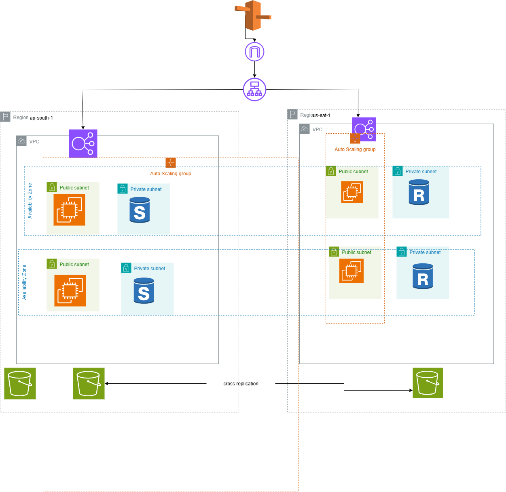

# 🌐 Multi-Region Disaster Recovery with AWS and Terraform
## Objective
To design and implement a multi-region disaster recovery solution using AWS services, where infrastructure is deployed in two AWS regions. The solution will replicate data across regions, ensure high availability, and implement a failover mechanism for disaster recovery. The project involves using Terraform to provision infrastructure.

### Services used
- **Amazon VPC** (Virtual Private Cloud) for networking
- **Amazon S3** for data replication across regions
- **Amazon RDS** for relational database deployment and cross-region replication
- **Amazon Route 53** for DNS failover routing
- **Terraform** for infrastructure provisioning
- **Jenkins / AWS CodePipeline** for CI/CD automation

## 🏗️ Architectural Overview

